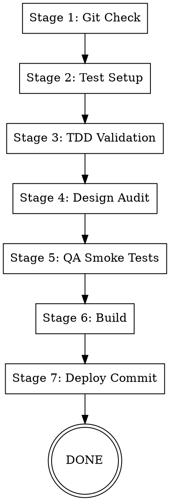
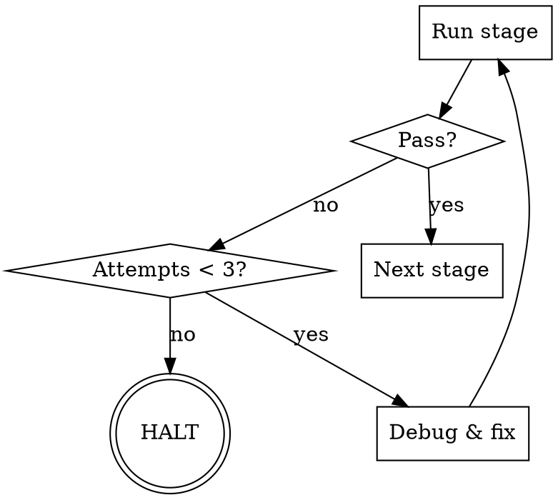

# Deploy Pipeline

Full deployment pipeline with 7 sequential stages. Each stage has a pass/fail gate. On failure, invoke systematic debugging to auto-fix, then retry (max 2 retries). If all retries fail, halt and report.

## Pipeline



## Failure Handling



On failure: use **superpowers:systematic-debugging** to diagnose root cause, apply fix, then re-run the failed stage. Max 2 retries per stage.

---

## Stage 1: Git Check

Identify and commit any uncommitted work before proceeding.

```bash
git status
```

- If unstaged/untracked changes exist: `git add` relevant files (not .env or secrets), commit with descriptive message
- If working tree is clean: proceed
- Verify branch has remote tracking: `git branch -vv`
- Note current branch name for final push

---

## Stage 2: Test Setup

Ensure test infrastructure exists. This stage is idempotent — safe to run repeatedly.

**Check Vitest:**
```bash
npx vitest --version
```

**If not installed:**
```bash
npm install -D vitest @testing-library/react @testing-library/jest-dom jsdom
```

**Create `vitest.config.ts` if missing:**
```typescript
import { defineConfig } from 'vitest/config';

export default defineConfig({
  test: {
    environment: 'jsdom',
    globals: true,
    include: ['tests/**/*.test.{ts,tsx}'],
  },
});
```

**Add test script to package.json if missing:**
```json
"test": "vitest run"
```

**Scaffold basic tests if `tests/` directory is empty or missing:**

`tests/shared/schema.test.ts`:
```typescript
import { describe, it, expect } from 'vitest';
import { insertAgentSchema, PERMISSION_MODES, AVAILABLE_MODELS } from '../../shared/schema';

describe('Schema', () => {
  it('validates agent insert schema', () => {
    const valid = insertAgentSchema.safeParse({
      name: 'Test Agent',
      description: 'A test agent',
      systemPrompt: 'You are a test agent.',
      model: 'sonnet',
      color: '#FF0000',
    });
    expect(valid.success).toBe(true);
  });

  it('exports permission modes', () => {
    expect(PERMISSION_MODES).toContain('default');
    expect(PERMISSION_MODES.length).toBeGreaterThan(0);
  });

  it('exports available models', () => {
    expect(AVAILABLE_MODELS).toContain('sonnet');
    expect(AVAILABLE_MODELS.length).toBeGreaterThan(0);
  });
});
```

`tests/server/routes.test.ts`:
```typescript
import { describe, it, expect } from 'vitest';

describe('API Routes (structure)', () => {
  it('placeholder for route tests', () => {
    // Smoke tests run in Stage 5 against live server
    expect(true).toBe(true);
  });
});
```

---

## Stage 3: TDD Validation

Run full test suite and TypeScript compilation.

```bash
npx vitest run
npx tsc --noEmit
```

**Pass gate:** 0 test failures AND 0 TypeScript errors.

On failure: read error output carefully, identify root cause, fix the specific issue, re-run.

---

## Stage 4: Design Audit

Two-phase audit against The Folio design system.

### Phase A: CSS Audit

Scan all `.tsx` and `.css` files for design system violations:

| Violation | Pattern to detect | Fix |
|-----------|-------------------|-----|
| Banned font | `Inter`, `Roboto`, `Arial`, `system-ui` used in styles | Replace with `font-display`, `font-body`, or `font-mono` |
| Raw hex color | Hex codes in component styles instead of CSS vars | Replace with `hsl(var(--...))` token |
| Missing font class | `font-sans` without `font-body` | Replace with `font-body` |
| Inline color style | `style={{ color: '#...' }}` | Use Tailwind class with design token |

**Search commands:**
```bash
# Banned fonts
grep -rn "Inter\|Roboto\|Arial\|system-ui" client/src/ --include="*.tsx" --include="*.css"

# Raw hex colors in components (excluding CSS variable definitions)
grep -rn "#[0-9a-fA-F]\{3,8\}" client/src/components/ --include="*.tsx"

# Inline color styles
grep -rn "style=.*color:" client/src/ --include="*.tsx"
```

Report each violation with `file:line` reference.

### Phase B: Visual Snapshots

Build the client and visually verify key pages:

```bash
npx vite build --outDir /tmp/deploy-preview
```

Confirm build output exists. If running in an environment with browser access, capture screenshots of:
- Agents list page
- Agent editor page
- Deploy page

If no browser access: confirm build succeeds and static assets are present.

**On failure:** Auto-fix obvious violations (font replacements, token substitutions). Retry audit.

---

## Stage 5: QA Smoke Tests

Automated endpoint verification against a running server.

**Start server:**
```bash
npm run dev &
DEV_PID=$!
```

**Wait for ready (poll with timeout):**
```bash
for i in $(seq 1 30); do
  curl -s http://localhost:5000/api/agents > /dev/null 2>&1 && break
  sleep 1
done
```

**Run smoke tests:**

| Endpoint | Method | Expected Status | Validation |
|----------|--------|-----------------|------------|
| `/api/agents` | GET | 200 | Response is array |
| `/api/agents` | POST | 201 | Body: `{name, description, systemPrompt, model, color}` |
| `/api/agents/:id` | GET | 200 | Response has `id`, `name` fields |
| `/api/agents/:id/export` | GET | 200 | Response is zip (content-type check) |
| `/api/skills` | GET | 200 | Response is array |
| `/api/commands` | GET | 200 | Response is array |

**Execute with curl:**
```bash
# GET agents
curl -s -o /dev/null -w "%{http_code}" http://localhost:5000/api/agents
# Expected: 200

# POST agent
curl -s -o /dev/null -w "%{http_code}" -X POST http://localhost:5000/api/agents \
  -H "Content-Type: application/json" \
  -d '{"name":"QA Test","description":"Smoke test agent","systemPrompt":"test","model":"sonnet","color":"#3B82F6"}'
# Expected: 201

# GET skills
curl -s -o /dev/null -w "%{http_code}" http://localhost:5000/api/skills
# Expected: 200

# GET commands
curl -s -o /dev/null -w "%{http_code}" http://localhost:5000/api/commands
# Expected: 200
```

**Cleanup:**
```bash
kill $DEV_PID 2>/dev/null
```

**On failure:** Identify which endpoint failed, debug, fix, re-run.

---

## Stage 6: Build

Production build verification.

```bash
npm run build
```

**Verify output:**
```bash
ls dist/
# Expected: index.cjs, public/ (with client assets)
```

**Pass gate:** Build exits 0, `dist/` contains expected output.

On failure: read build errors, fix, retry.

---

## Stage 7: Deploy Commit

Final commit and push.

```bash
git add -A
git commit -m "deploy: verified build $(date +%Y-%m-%d-%H%M)"
```

The post-commit hook auto-pushes to GitHub. Verify:
```bash
git log --oneline -1
git branch -vv
```

**Report final summary:**
```
Deploy Pipeline Complete
========================
Stage 1 Git Check:      PASS
Stage 2 Test Setup:     PASS
Stage 3 TDD Validation: PASS (X tests, 0 failures)
Stage 4 Design Audit:   PASS (0 violations)
Stage 5 QA Smoke Tests: PASS (6/6 endpoints)
Stage 6 Build:          PASS
Stage 7 Deploy Commit:  PASS (commit SHA)
```

---

## Red Flags

- NEVER skip a stage — stages are sequential and mandatory
- NEVER ignore test failures — fix them or halt
- NEVER commit secrets (.env, credentials) — exclude from staging
- NEVER force-push — use regular push only
- NEVER proceed past 3 failed attempts — halt and report to user
- NEVER run the pipeline on `main` without confirming with the user first
